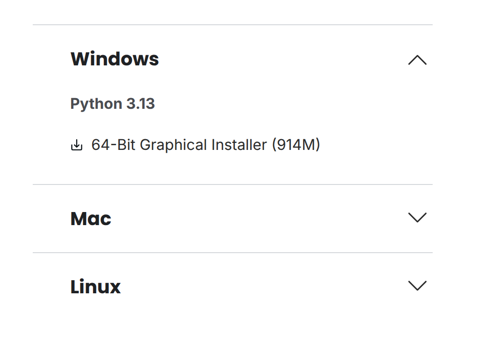
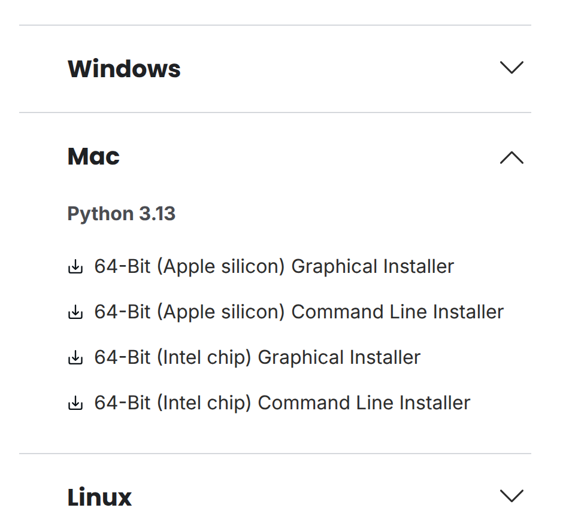
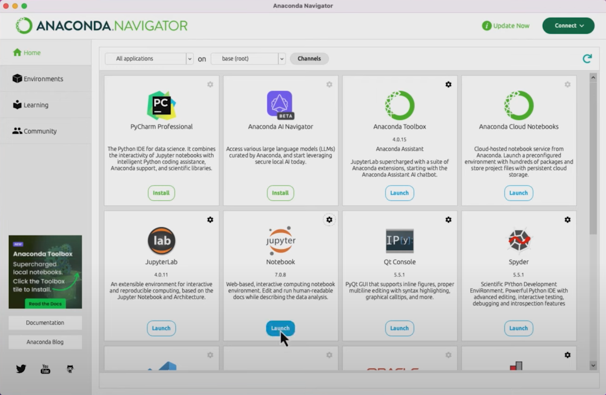
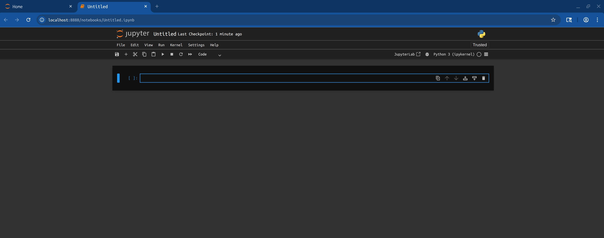

# Installing Anaconda: A Step-by-Step Guide

🐍🐍🐍


**Goal:** Learn how to install Anaconda on macOS and Windows.

---

## 🧩 What is Anaconda?
Anaconda is a distribution of **Python** that includes tools like **Jupyter Notebook** and a package manager (**conda**)-- you'll learn what a package is soon. 

So basically:
- python = programming language
- anaconda = python + tools + packages

Similar to:
- MS Word to edit documents
- Jupyter Notebook to write and run Python code

There are many ways to edit and run Python code, but Anaconda is one of the easiest ways to get started.

---

## ⚙️ Before You Start
1. Make sure you have an internet connection.
2. You can install new apps.
3. Know whether your computer runs **Windows** or **macOS**.
   - On Mac, click the Apple menu → *About This Mac* to check if you have **Intel** or **Apple Silicon (M1/M2)**.

---

## 🌐 Step 1: Go to the Anaconda Download Page
Visit the official Anaconda download page:
👉 [https://www.anaconda.com/download/success](https://www.anaconda.com/download/success)


Note, you have two choices:
- Distribution Installers (recommended)
- Miniconda Installers (smaller installation if you don't have much storage)
---

## 🪟 Step 2: Installing on Windows
1. Open a web browser (Chrome, Edge, Firefox) and visit the Anaconda download page.
2. Click the **Windows** button and download the **64-bit Graphical Installer**.

3. Wait for the `.exe` file to finish downloading.
4. Double-click the file to start the installer. If prompted, click **Yes** to allow changes.
5. In the installer, click **Next**, then **I Agree**.
6. Leave the “Add Anaconda to my PATH” box **unchecked** (recommended).
7. Click **Install** — it might take several minutes.
8. Once done, click **Finish**.
9. Open the Start Menu → Search for **Anaconda Navigator** or **Anaconda Prompt**.

To confirm installation, open *Anaconda Prompt* and type:
```bash
conda --version
```
You should see something like `conda 23.0.1`.

---

## 🍎 Step 3: Installing on macOS
1. Visit the same Anaconda download page.
2. Click the **macOS** button.
   - Choose **Apple Silicon (ARM64)** for M1/M2 Macs, or **Intel (x86_64)** for older Macs.

3. Wait for the `.pkg` (or `.sh`) file to download.
4. Double-click the `.pkg` file to run the installer.
5. Follow on-screen steps and enter your Mac password if prompted.
6. After installation, open **Finder → Applications → Anaconda-Navigator**.

### if you want to use the command line (Terminal):
1. Open **Finder → Applications → Utilities → Terminal** **Terminal** (by doing a Spotlight search) and check installation by typing into the window:
```bash
conda --version
```
If you see a version number, it’s installed correctly!

If you get `command not found`, restart Terminal and try again.

---


## 📓 Step 4: Open Jupyter Notebook

You can start coding using **Jupyter Notebook**:

### Option 1: Using Anaconda Navigator
1. Open **Anaconda Navigator**.
    - note, you see a lot of apps, but we will focus on Jupyter Notebook for now
2. Click **Launch** under *Jupyter Notebook*.




### Option 2: Using the Command Line
```bash
jupyter notebook
```
A browser window will open — you can create and run Python notebooks there.

---


# Success! You have installed Anaconda and opened Jupyter Notebook. 🎉

It should open in your default web browser, and show your files and folders.

1. make a new folder where you will save your notebooks
2. click "New" → "Python 3" to create a new notebook
3. it should open a new tab with an empty notebook
4. it should look something like this:


   - name it something that makes sense
   - make a habit of organizing your files and file names well


<!-- 
## 🧠 Step 6: Create a Python Environment (Optional but Recommended)
Environments help you keep different projects separate.
```bash
# Create a new environment
conda create -n myenv python=3.10

# Activate the environment
conda activate myenv

# Install useful packages
conda install numpy pandas matplotlib

# Deactivate when done
conda deactivate
```

---

## 🧾 Quick Command Reference
```bash
conda --version           # check conda version
conda update -n base conda # update conda
conda create -n myenv python=3.10 # create environment
conda activate myenv      # activate environment
conda install package_name # install a package
conda env list            # list environments
conda remove -n myenv --all # delete environment
jupyter notebook          # launch Jupyter
```

--- -->

## 🧩 Troubleshooting Tips
| Problem                     | Fix                                                                        |
| --------------------------- | -------------------------------------------------------------------------- |
| Installer blocked on Mac    | Go to **System Settings → Privacy & Security**, then click **Open Anyway** |
| `conda` not found           | Close and reopen Terminal or Anaconda Prompt                               |
| Permission error            | Run the installer as Administrator (Windows) or allow permissions (macOS)  |
| Already have another Python | That’s fine — just use Anaconda Navigator or Anaconda Prompt               |

---

